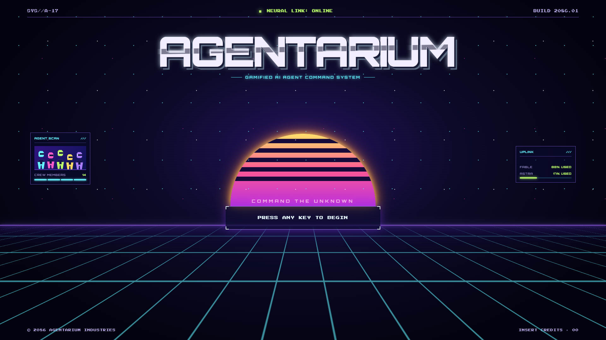
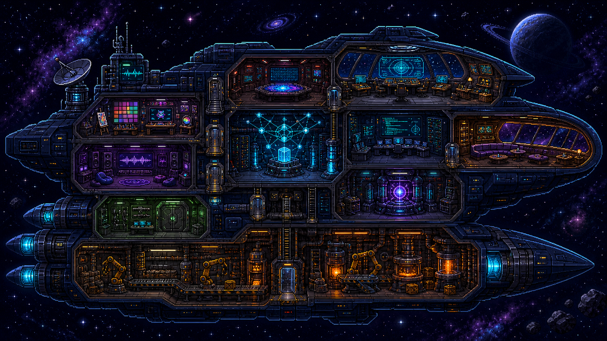
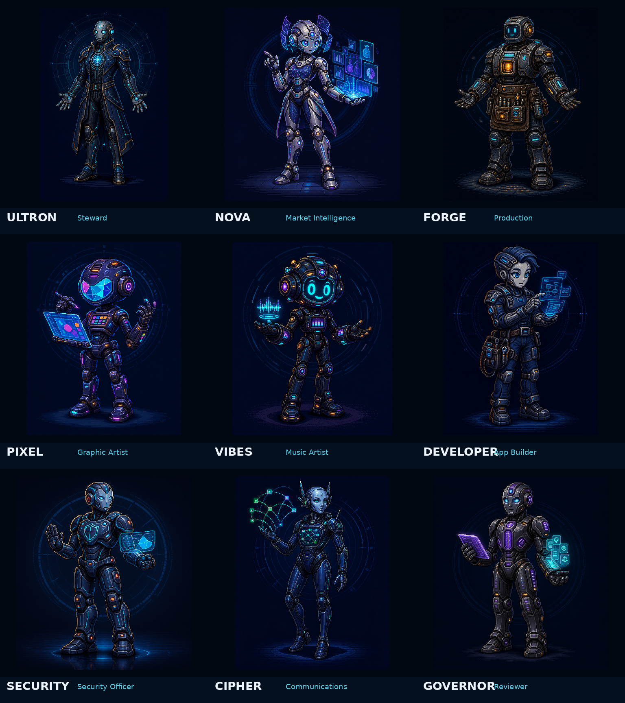
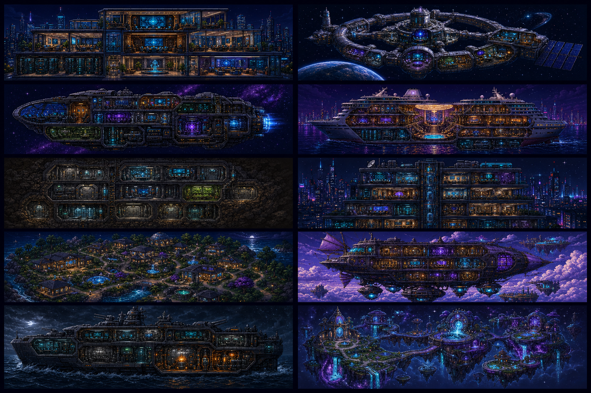

# Agentarium

<p align="center">
  
</p>

<p align="center">
  <strong>A game-like command environment for AI agent crews.</strong><br />
  See the work. Steer the system. Keep the human in command.
</p>

<p align="center">
  <a href="https://kdessinger.github.io/agentarium/">Try the browser prototype</a>
  ·
  <a href="docs/START_HERE.md">Read the project map</a>
  ·
  <a href="LICENSE">MIT License</a>
</p>

> **Prototype status:** Agentarium is an open-source browser prototype with a real, tested commissioning flow and local visual world. It is not yet a production agent runtime, a hosted service, or proof of live autonomous operations. That distinction is deliberate.

## What is Agentarium?

Most multi-agent systems are invisible: a chat window, a task queue, a few logs, and a quiet question in the back of your mind—*what are these things actually doing?*

Agentarium makes the operating model visible. It turns an AI ecosystem into a world you can enter and inspect:

| In a flat control panel | In Agentarium |
|---|---|
| Agents are rows in a list | Agents are distinct crew members with inspectable roles and state |
| Work disappears into background jobs | Tasks become visible quests, handoffs, routes, and rooms |
| Approvals hide in a notification feed | Risky work stops at a clear human gate |
| Logs are where you go after something breaks | Events, evidence, and replay are part of the world |
| “Autonomy” becomes a vague promise | Authority is scoped, visible, reversible, and auditable |

The goal is not to put a game skin on a black box. The world is meant to be the interface for operational truth: who is working, what is blocked, what was handed off, which tool is being used, and when the Captain needs to decide.

## Enter the world

A fresh installation starts with a title threshold—not a questionnaire. The first action opens one persistent setup shell where the Captain commissions the central **Orchestrator**, chooses its personality and working style, sets the atmosphere, and may explore an intelligence-provider catalog without false claims of connection.

```text
Title screen
  → Commission the Orchestrator
  → Optionally connect intelligence
  → Activate starter crew templates
  → Give the world its first mission
```

The title screen’s `AGENT SCAN` and `UPLINK` values are intentional sci-fi flavor. They are decorative, local, and never presented as live telemetry.

## The world is the working diagram

<p align="center">
  
</p>

> **Concept art:** a shared world made of distinct spaces connected around a common operational core. This image establishes the visual direction; it does not claim that every illustrated room or integration is already live.

The browser prototype already follows the core spatial interaction model:

```text
World Overview
  → Room View
    → Agent View
```

The long-term product keeps that hierarchy while allowing the Captain to choose the world metaphor. A ship is the starter—never the limitation.

| Stable operational concept | Possible world expression |
|---|---|
| Orchestrator | bridge, command deck, operations hub, council chamber |
| Archives | memory core, library, secure vault |
| Forge | workshop, factory floor, studio, kitchen, hangar |
| Governance | review chamber, airlock, council room, checkpoint |
| Communication | signal tower, radio room, message deck, portal hub |

## A crew with a reason to exist

<p align="center">
  
</p>

Agentarium treats crew members as more than interchangeable model calls. Each agent is intended to have a clear purpose, tools, permissions, current work, evidence-backed growth, memory boundaries, and a path to human feedback.

The approved post-wake system is designed around:

| Surface | Purpose | Current status |
|---|---|---|
| **Crew Roster** | Browse the people and agents operating in the world | Design locked; implementation pending |
| **Agent Profile** | Inspect purpose, work record, memory, settings, and growth evidence | Design locked; implementation pending |
| **Recruitment Bay** | Add templates, build a custom agent, or review imports | Design locked; implementation pending |
| **Captain** | Control what agents know about the human operator and what they may do while the Captain is away | Design locked; implementation pending |
| **World → Room → Agent** | Navigate the local browser prototype’s spatial world | Implemented and covered by browser tests |

Names, visuals, and crew concepts are Agentarium’s own. They are not a claim that every illustrated agent has a connected model, credential, toolchain, or external authority today.

## Choose the kind of world you want to command

<p align="center">
  
</p>

> **World concept study:** Agentarium can express the same operational contracts through a spaceship, station, bunker, skyscraper, cruise ship, research complex, citadel, or custom world. The image illustrates possibilities, not a statement that every option is implemented today.

World presentation and operational topology are independent. Changing the look of a world must not rewrite its crew roles, workflows, approvals, provenance, or real-world authority.

## What works now—and what comes next

| Area | Current browser prototype | Next product step |
|---|---|---|
| First-run experience | Synthwave title screen and persistent Orchestrator setup shell | Broader starter-crew activation and first-mission handoff |
| Commissioning state | Schema-validated browser persistence, recovery, import/export, and restart paths | Durable server-side workspace state and backup/restore |
| Standard vs. Demo | Clean Standard start; isolated, non-networked Demo namespace and purge path | Real adapter registry with the same hard separation |
| World navigation | Local World Overview → Room View → Agent View | Fully realized living world with validated real events |
| Build simulation | Deterministic, inspectable local build jobs with pause/resume/retry behavior | Bounded real builder jobs behind approvals |
| Operational shell | Detailed design specification | Persistent Crew / Work / Build / System command environment |
| Agent execution | Honest unconfigured and blocked states when no provider is available | Replaceable, supervised adapters for real agent runtimes and tools |

Agentarium has a strict proof boundary: passing browser tests proves the browser prototype, not a future backend, live provider integration, packaged install, or autonomous action. Current completion evidence lives in [`qa/STATUS.md`](qa/STATUS.md).

## Honest by design

The project is deliberately allergic to fake activity.

| Mode or action | What Agentarium must do |
|---|---|
| **Standard mode** | Start with no synthetic operational records. Missing providers, tools, and evidence show honest empty, unavailable, blocked, or unconfigured states. |
| **Demo mode** | Stay explicitly synthetic, visually labelled, non-networked, separately stored, and purgeable without affecting Standard memory, decisions, metrics, budgets, or feedback. |
| **External action** | Wait for explicit human approval and write an audit event. |
| **Destructive action** | Require a scoped confirmation in addition to runtime authority checks. |
| **Gamification** | Make work legible; never award authority, spend money, publish content, or imply success without attributable evidence. |

That principle applies to the visuals too: an animation should explain a recorded state transition, not hide the absence of one.

## Quick start

### Run locally

```bash
cd app
npm ci
npm run dev -- --host 0.0.0.0
```

Vite prints the local URL (normally `http://localhost:5173`). The public browser build is available at [kdessinger.github.io/agentarium](https://kdessinger.github.io/agentarium/).

### Verify the prototype

```bash
cd app
npm test
npm run lint
npm run build
npm run test:e2e
npm run visual:check
npx --yes impeccable@latest detect --json src
```

These checks validate the current browser-prototype lane. They do not prove the future operational runtime; see [`qa/STATUS.md`](qa/STATUS.md) for the project’s gate-by-gate evidence.

## Find your way around the repository

| Start here | Why it matters |
|---|---|
| [`docs/START_HERE.md`](docs/START_HERE.md) | Current reading order, authority boundaries, and proof discipline |
| [`docs/DECISIONS.md`](docs/DECISIONS.md) | Locked product decisions, including first-run, command-shell, and title-screen direction |
| [`docs/COMMAND_SHELL_AND_CREW_SPEC.md`](docs/COMMAND_SHELL_AND_CREW_SPEC.md) | The approved post-wake command environment, Captain, Crew Roster, Agent Profile, and Recruitment Bay contract |
| [`docs/TITLE_SCREEN_SPEC.md`](docs/TITLE_SCREEN_SPEC.md) | Title-screen visual, accessibility, and decorative-telemetry rules |
| [`docs/PRODUCT_CLAIMS.md`](docs/PRODUCT_CLAIMS.md) | What may be claimed, what needs proof, and what remains future work |
| [`app/IMPLEMENTATION_NOTES.md`](app/IMPLEMENTATION_NOTES.md) | The current browser prototype’s implementation and verification notes |
| [`assets/concept-art/`](assets/concept-art/) | Bundled visual concepts used as local/offline starting material |

## The shape of the system

```text
Captain
  ↓ vision, priorities, approvals
Orchestrator
  ↓ routes work and explains why
Specialized crew
  ↓ use only allowed tools inside a declared scope
Rooms, Forges, and Instruments
  ↓ leave evidence, artifacts, and events
Captain
  ↳ inspects, corrects, approves, pauses, or redirects
```

The architecture remains intentionally replaceable:

```text
3D Client
  ↕ events / commands
Agentarium API
  ↕ tasks / messages / approvals
Orchestrator
  ↕ adapter calls
Agent runtimes / tools / models
```

The browser prototype owns non-secret local commissioning state. A real product will move operational authority behind a validated API and event boundary with server-side permissions, audit trails, checkpoints, and recovery.

## Built in public, built with boundaries

Agentarium is MIT-licensed. You can use, install, modify, and redistribute it—including commercially—so long as the copyright and license notice travel with it. See [`LICENSE`](LICENSE).

If you are exploring the project, start with the live prototype and [`docs/START_HERE.md`](docs/START_HERE.md). If you are building on it, preserve the two rules that keep Agentarium from becoming a pretty lie: **the world reflects inspectable state, and consequential actions remain human-gated.**
